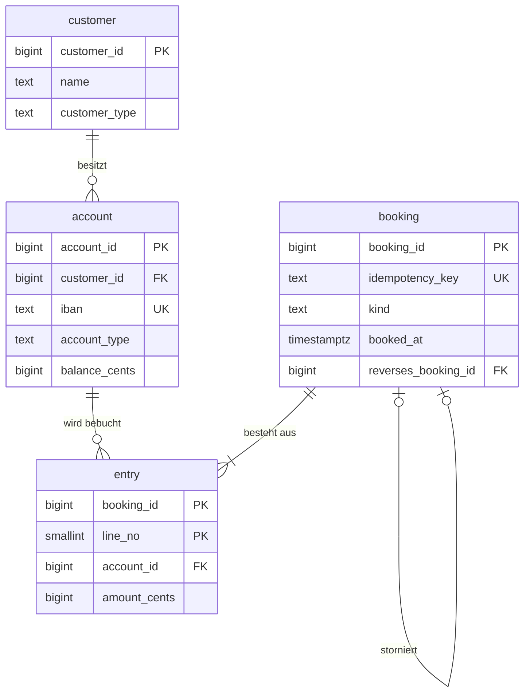

# 🏦 mini-kernbank

**Ein Kontobuch, das auch unter Last keinen Cent verliert, und drei erklärbare Regeln zur Geldwäsche-Erkennung.**

PostgreSQL 16 · Python · psycopg · pytest

---

## Ergebnis in Kürze

**Teil 1: Transaktionssicherheit.** 8 parallele Verbindungen buchen 2.000 Überweisungen zwischen 10 Konten.
Am Ende müssen exakt 5.000,00 € vorhanden sein.

| Variante | Geldmenge am Ende | Konten mit falschem Stand | Dauer |
|---|---|---|---|
| naiv: Kontostand lesen, rechnen, zurückschreiben | 5.163,55 € | 10 von 10 | 2,6 s |
| naiv + Isolationslevel `SERIALIZABLE` + Wiederholung | 5.000,00 € | 0 | 6,7 s (5.463 Wiederholungen) |
| **`bank.transfer()` mit Zeilensperren (`FOR UPDATE`)** | **5.000,00 €** | **0** | **1,6 s** |

Die naive Variante erzeugt 163,55 € aus dem Nichts (Lost Update). Beide sicheren Varianten sind korrekt,
die Zeilensperren sind hier aber rund viermal schneller, weil nichts wiederholt werden muss.
Die Zahlen der naiven Variante schwanken von Lauf zu Lauf, falsch ist sie jedes Mal.

**Teil 2: Geldwäsche-Erkennung.** In 24.181 simulierten Buchungen von 340 Kunden sind drei Muster versteckt.
Drei SQL-Regeln suchen sie, jede mit einer Begründung in Klartext.

| Regel | Alarme | richtig | Fehlalarme | verpasst | Precision | Recall |
|---|---|---|---|---|---|---|
| Smurfing | 17 | 9 | 8 | 3 | 53 % | 75 % |
| Durchlaufkonto | 15 | 7 | 8 | 3 | 47 % | 70 % |
| Kreisüberweisung | 23 | 23 | 0 | 6 | 100 % | 79 % |

**Die wichtigste Erkenntnis: Die Hälfte der Alarme war zunächst falsch, und die Ursache war fachlich, nicht technisch.**
Alle 8 Fehlalarme beim Smurfing sind Autohändler und Juweliere, die täglich Bargeld einzahlen.
Gilt die Regel nur für Privatkunden, verschwinden sie (Precision 100 %). Erst danach kann man die Schwelle
senken und findet auch die getarnten Fälle (Recall 100 %). Ohne die Trennung nach Kundengruppe erzeugt dieselbe
Senkung 21 Fehlalarme. Alle Zahlen: [reports/aml.md](reports/aml.md) und [reports/nebenlaeufigkeit.md](reports/nebenlaeufigkeit.md).

## Teil 1: Das Kontobuch



Was die Datenbank selbst garantiert, unabhängig vom Programm, das auf sie zugreift:

| Garantie | Umsetzung |
|---|---|
| Jede Buchung ist ausgeglichen (Soll = Haben) | `CONSTRAINT TRIGGER`, geprüft beim `COMMIT` (`DEFERRABLE INITIALLY DEFERRED`) |
| Buchungen sind unveränderlich | Trigger verbieten `UPDATE`, `DELETE` und `TRUNCATE`; Korrektur nur per Storno |
| Kundenkonten gehen nicht ins Minus | `CHECK`-Constraint und Prüfung unter Zeilensperre |
| Derselbe Auftrag wird nur einmal gebucht | `idempotency_key UNIQUE` und `INSERT … ON CONFLICT DO NOTHING` |
| Eine Buchung wird höchstens einmal storniert | `reverses_booking_id UNIQUE` |
| Nur gültige IBANs | Prüfziffer nach Modulo 97 als SQL-Funktion im `CHECK` |
| Kontostand = Summe der Buchungszeilen | Sicht `bank.v_reconciliation` zeigt jede Abweichung |

**Warum die naive Variante Geld erfindet.** Zwei Überweisungen lesen gleichzeitig denselben Kontostand (100 €).
Die eine schreibt 100 − 30 = 70 €, die andere 100 − 20 = 80 €. Die zweite überschreibt die erste, 30 € Abbuchung
sind verloren. `bank.transfer()` sperrt deshalb zuerst beide Kontozeilen mit `SELECT … FOR UPDATE`.

**Warum die Sperren sortiert werden.** Überweist A an B und gleichzeitig B an A, sperrt sonst jede Seite ein Konto
und wartet auf das andere (Deadlock). Sperrt man immer in der Reihenfolge der `account_id`, kann das nicht passieren.

**Beträge sind ganze Cent (`BIGINT`).** Gleitkommazahlen können 0,10 € nicht exakt darstellen.

## Teil 2: Geldwäsche-Erkennung

Die Simulation erzeugt 91 Tage normalen Zahlungsverkehr (Gehalt, Miete, Einkäufe, Bargeld) und versteckt darin
Muster. Ein Teil der Täter ist getarnt, dazu kommen harmlose Lockvögel, die ähnlich aussehen.
Die Liste der wirklich verdächtigen Konten (`eval.truth`) dient nur zur Bewertung, die Regeln lesen sie nie.

| Regel | Was sie sucht | SQL-Technik |
|---|---|---|
| **Smurfing** | Mehrere Bareinzahlungen knapp unter 10.000 € in 7 Tagen. Ab dieser Schwelle verlangen Banken in Deutschland seit August 2021 einen Herkunftsnachweis. | Self-Join über ein gleitendes Zeitfenster |
| **Durchlaufkonto** | An mindestens 3 Tagen kommen über 5.000 € an und werden zu 90 bis 105 % binnen 48 Stunden weitergeleitet (typisch für Finanzagenten). | Aggregation je Tag, korrelierte Unterabfrage |
| **Kreisüberweisung** | Geld wandert A → B → C → A, zeitlich geordnet und mit fast gleichem Betrag. | Rekursive CTE auf dem Überweisungsgraphen |

Jeder Alarm trägt seine Begründung, zum Beispiel:

> Kreisüberweisung über 5 Konten (206 -> 295 -> 103 -> 9 -> 151 -> 206), Startbetrag 22.500,00 EUR, Rückfluss 20.003,50 EUR nach 111 Stunden

Alle Schwellenwerte stehen mit Beschreibung in der Tabelle `aml.param`. Es sind Annahmen dieses Projekts,
keine Vorgaben einer Bank oder Aufsicht.

### Was passiert, wenn man die Schwellenwerte ändert?

| Änderung | Alarme | Fehlalarme | verpasst | Precision | Recall |
|---|---|---|---|---|---|
| Smurfing: nur Privatkunden | 9 | 0 | 3 | 100 % | 75 % |
| Smurfing: nur Privatkunden, schon ab 50 % der Schwelle | 12 | 0 | 0 | 100 % | 100 % |
| Smurfing: alle Kunden, schon ab 50 % der Schwelle | 33 | 21 | 0 | 36 % | 100 % |
| Durchlauf: Muster an mindestens 4 Tagen | 6 | 0 | 4 | 100 % | 60 % |
| Durchlauf: Weiterleitung innerhalb von 5 Tagen | 17 | 8 | 1 | 53 % | 90 % |
| Kreis: bis zu 7 Tage zwischen zwei Stationen | 29 | 0 | 0 | 100 % | 100 % |

Beim Durchlaufkonto gibt es keine Einstellung, die beides löst: Die 8 Fehlalarme sind Gutverdiener, die ihr Gehalt
am nächsten Tag aufs Tagesgeld schieben. Strengere Regeln entfernen sie, verpassen dann aber einen echten Fall.
Hier bräuchte man ein weiteres Merkmal, etwa ob das Geld an ein eigenes Konto geht.

## Grenzen

- **Die Daten sind simuliert, und ich habe die Muster selbst eingebaut.** Die Trefferquoten zeigen, dass die Regeln
  tun, was sie sollen, und wie sich Schwellenwerte auswirken. Sie sagen nichts darüber, wie gut die Regeln auf
  echten Bankdaten wären. Dort sind Muster unschärfer und Fehlalarme viel häufiger.
- Getarnte Varianten werden mit den Standardwerten zu 0 % erkannt. Das ist gewollt: Feste Regeln finden nur den,
  der sich nicht anpasst.
- Jede Buchung hat genau zwei Zeilen. Sammelbuchungen und Gebühren (drei oder mehr Zeilen) erlaubt das Schema,
  die Sicht `bank.v_transfer` aber nicht.
- Externe Banken sind ein einziges Verrechnungskonto. Kreise, die über andere Banken laufen, sind deshalb unsichtbar.
- Kein Währungsumtausch, keine Zinsen, keine Valuta-Daten.

## Starten

Voraussetzung: PostgreSQL 16 mit einer Datenbank `kernbank` (Benutzer und Passwort `postgres`), zum Beispiel
über `docker compose up -d`. Eine andere Verbindung setzt man mit der Umgebungsvariable `KERNBANK_DSN`.

```bash
pip install -r requirements.txt

python run.py nebenlaeufigkeit   # Teil 1, etwa 15 Sekunden
python run.py aml                # Teil 2: Daten simulieren, laden, Regeln bewerten
pytest                           # 18 Tests, nutzen die eigene Datenbank kernbank_test
```

Danach liegen die Simulationsdaten in der Datenbank, zum Beispiel:

```sql
SELECT regel, account_id, begruendung FROM aml.v_alert ORDER BY regel, account_id;
SELECT * FROM bank.v_reconciliation WHERE diff_cents <> 0;   -- muss leer sein
```

## Projektstruktur

```
mini-kernbank/
├── sql/
│   ├── 01_schema.sql      # Tabellen, Constraints, Trigger, IBAN-Prüfung
│   ├── 02_functions.sql   # bank.transfer() und bank.reverse()
│   └── 03_aml.sql         # Schwellenwerte und die drei Regeln als Sichten
├── src/kernbank/
│   ├── concurrency.py     # Experiment mit parallelen Überweisungen
│   ├── generator.py       # Simulation mit versteckten Mustern
│   ├── evaluate.py        # Precision, Recall, Schwellen-Szenarien
│   ├── iban.py            # IBAN erzeugen und prüfen
│   └── db.py
├── tests/                 # pytest: Garantien des Kontobuchs und Regeln an Mini-Beispielen
├── reports/               # von run.py erzeugt
└── run.py
```

---

Mohammadmahdi Nemati · Informatik-Student an der Heinrich-Heine-Universität Düsseldorf
